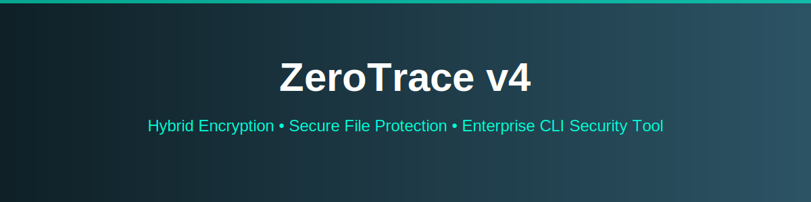
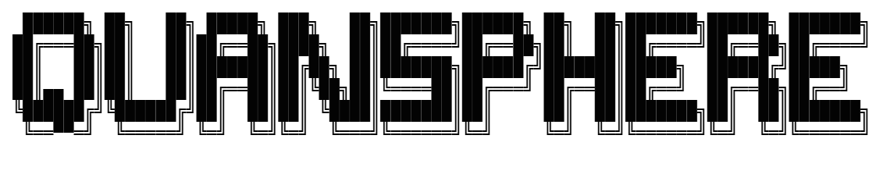

<p align="center">
  
</p>

<div align="center">


</div>

---

# 🔐 ZeroTracer v4 - Hardened Crypto Toolkit

ZeroTrace v4 is a hardened cryptography toolkit engineered for secure data encryption built in Python.  
It supports AES-GCM, RSA-OAEP, Hybrid Encryption, Digital Signature (RSA-PSS), and SHA hashing with enhanced security validation..

---

## 📦 Repository Structure

```bash
│
├── assets
├── .gitignore
├── README.md
├── requirements.txt
└── zerotracer.py
```

---

## ✨ Features

The project demonstrates practical implementation of modern cryptographic standards including:
- AES-256 GCM file encryption/decryption
- RSA-2048 key generation
- RSA-OAEP encryption/decryption
- Hybrid encryption (RSA + AES)
- Digital signature (RSA-PSS)
- SHA256 & SHA512 hashing
- Secure PBKDF2 key derivation

---

## ⚙️ Installation

```bash
git clone https://github.com/RakkaEvandra06/QuanSphere.git
cd QuanSphere
pip install -r requirements.txt
python3 zerotrace.py --help
```

## 🎯 Install the required package

Install pycryptodome for the Version Windows or Linux you're running:
if you're on Windows:
```bash
python pip install pycryptodome
```

If you're on Linux:
```bash
sudo apt install python3-pycryptodome
```

## 🧪 Test Installation

After installing, test:
```bash
python3 -c "from Crypto.Cipher import AES; print('OK')"
```
Output:
If it prints OK, you're good.

## 🚨 If it STILL fails

Quick One-Command Version
```bash
sudo apt install python3-venv -y
python3 -m venv venv
source venv/bin/activate
pip install pycryptodome
python zerotracer.py
```

---

## 🚀 Usage

🔑 Generate RSA Key Pair
```bash
python zerotracer.py genrsa
```

🔐 AES Encryption
Encrypt using password-based key derivation:
```bash
python zerotracer.py aes --encrypt file.txt --out file.enc --password StrongPassword123
```

Encrypt using randomly generated key:
```bash
python zerotracer.py aes --encrypt file.txt --out file.enc --save-key
```

🔓 AES Decryption
```bash
python zerotracer.py aes --decrypt file.enc --out file.txt --password StrongPassword123
```

🔐 RSA Encryption (Short Message)
```bash
python zerotracer.py rsa --encrypt "Sensitive Message" --pub public.pem
```

🔓 RSA Decryption
```bash
python zerotracer.py rsa --decrypt <base64_ciphertext> --priv private.pem
```

🔐 Hybrid Encryption (Recommended for Files)

Encrypt:
```bash
python zerotracer.py hybrid --encrypt document.pdf --out document.qhy --pub public.pem
```

Decrypt:
```bash
python zerotracer.py hybrid --decrypt document.qhy --out document.pdf --priv private.pem
```

✍ Digital Signature
Sign a file:
```bash
python zerotracer.py sign --file file.txt --priv private.pem
```

Verify signature:
```bash
python zerotracer.py sign --verify file.txt --sig file.txt.sig --pub public.pem
```

🧮 Hashing

SHA-256
```bash
python zerotracer.py hash --file file.txt --algo sha256
```

SHA-512
```bash
python zerotracer.py hash --file file.txt --algo sha512
```

---

## ⚠️ Disclaimer

This toolkit is developed for educational and research purposes.

<p align="center">
  
</p>